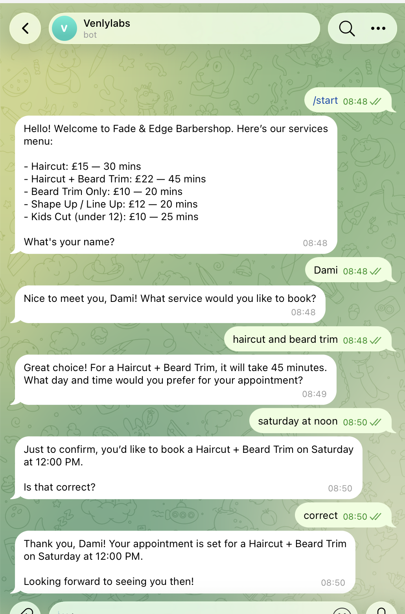

# BookBot — AI Appointment Booking Bot for Telegram

A conversational Telegram bot that handles appointment bookings for a barbershop. Built with Node.js, Telegraf, and GPT-4o-mini. Bookings are logged automatically to Google Sheets.

---

## Demo



> The bot greets customers, presents the services menu, collects name, service, and preferred time through natural conversation, then confirms and logs the booking.

---

## Features

- Natural language booking flow — no buttons or forms
- Handles typos, out-of-order information, and off-topic questions
- Validates appointment times against opening hours and service duration
- Logs structured booking data (name, service, day, time) to Google Sheets
- `/reset` command to restart a conversation
- Persistent typing indicator during AI processing

---

## Tech Stack

| Layer | Technology |
|---|---|
| Bot framework | [Telegraf](https://telegraf.js.org/) |
| AI | GPT-4o-mini via OpenAI API |
| Data storage | Google Sheets via Sheets API v4 |
| Runtime | Node.js |
| Hosting | Railway |

---

## How It Works

1. User messages the bot on Telegram
2. Each message is passed to GPT-4o-mini with the full conversation history
3. GPT collects three pieces of information one at a time: name, service, and preferred time
4. Once all three are collected and confirmed, GPT appends `[BOOKING_READY]` with structured JSON to its response
5. The bot detects the tag, strips it from the user-facing message, parses the JSON, and writes a row to Google Sheets

---

## Project Structure

```
bookbot/
├── index.js          # Main bot logic
├── .env.example      # Environment variable template
├── package.json
└── README.md
```

---

## Getting Started

### Prerequisites

- Node.js v18+
- A Telegram bot token from [@BotFather](https://t.me/botfather)
- An OpenAI API key
- A Google Cloud service account with Sheets API enabled

### Installation

```bash
git clone https://github.com/your-username/bookbot.git
cd bookbot
npm install
```

### Environment Variables

Copy `.env.example` to `.env` and fill in your values:

```bash
cp .env.example .env
```

```env
BOT_TOKEN=your_telegram_bot_token
OPENAI_API_KEY=your_openai_api_key
GOOGLE_CLIENT_EMAIL=your_service_account@project.iam.gserviceaccount.com
GOOGLE_PRIVATE_KEY=your_private_key
SPREADSHEET_ID=your_google_sheet_id
```

### Google Sheets Setup

1. Create a new Google Sheet
2. Add these headers to row 1: `Timestamp`, `Name`, `Service`, `Day`, `Time`
3. Share the sheet with your service account email (Editor access)
4. Copy the Sheet ID from the URL into your `.env`

### Running Locally

```bash
node index.js
```

### Deploying to Railway

1. Push to GitHub
2. Create a new Railway project and connect your repo
3. Add all environment variables under the Variables tab
4. Railway will deploy automatically on every push

---

## Commands

| Command | Description |
|---|---|
| `/start` | Start a new booking conversation |
| `/reset` | Clear the current conversation and start over |

---

## Business Context

Built as a portfolio project for [Venly Labs](https://venlylabs.com) to demonstrate AI-powered customer-facing automation for small businesses. The fictional client is **Fade & Edge Barbershop**, a London independent barber.

**Problem solved:** Missed calls and lost bookings. No system to capture leads or communicate services and pricing.

**Result:** A 24/7 booking assistant that captures structured lead data with zero manual input from the business owner.

---

## Future Improvements

- Persist conversation sessions to Redis (currently in-memory, resets on redeploy)
- Add calendar integration (Google Calendar) to check real availability
- Send owner notifications via Telegram when a booking is confirmed
- Support multiple staff members and services per visit

---

## Built By

[Venly Labs](https://venlylabs.com) — AI Automation & Bot Development  
[@venlylabs](https://instagram.com/venlylabs)
